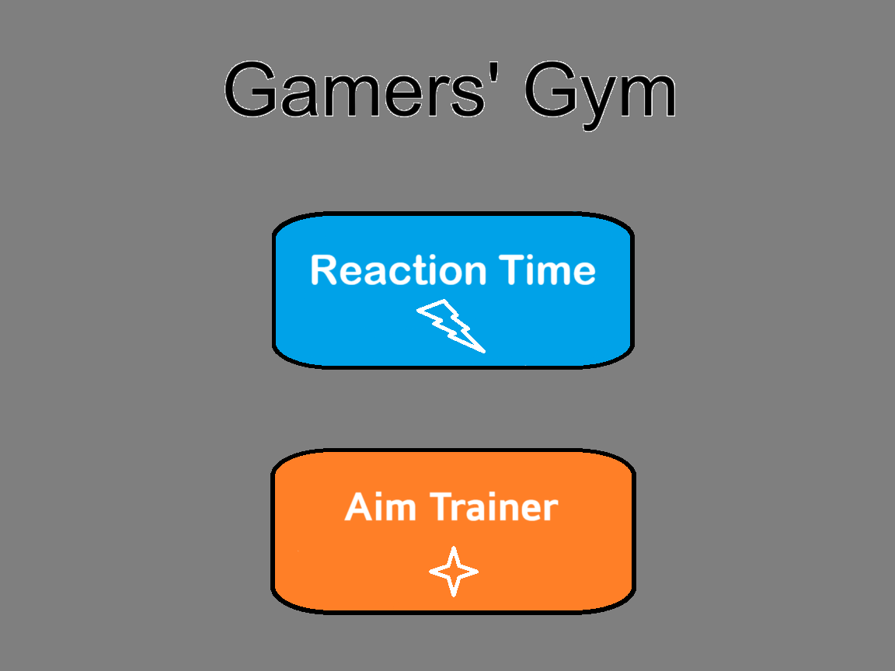

# Project "Gamers' Gym"

## Project Description

Neste jogo pretendemos implementar dois jogos: um jogo de reação o outro jogo de "aim trainer". Ambos os jogos são interativos e têm como objetivo melhorar as habilidades de entusiastas de videojogos entre outros. Iremos ter um menu onde o jogador pode escolher o jogo. Após a escolha do jogo um novo screen com o jogo escolhido aparece e o jogador pode iniciar o jogo.

## Devices planned to use

1. Timer/Counter:

    - Para o mini-jogo de tempo de reação o timer/counter será a base para o funcionamento do jogo. Após o jogador acionar o jogo, após um tempo definido a tela muda de cor e o jogador tem de pressionar a barra de espaço para contabilizar o tempo da sua reação. O timer será fundamental para contabilizar o tempo de começo do jogo tanto como o cálculo do tempo de reação

2. Keyboard:

    - Usado no jogo de tempo de reação para parar o "timer" e contabilizar o tempo de reação (space bar)

3. Video Card:

    - Fundamental para a visualização do jogo e para a mudança de cores e gráficos do nosso jogo tanto no jogo de reação como no "aim trainer" onde um alvo mudará de local.

4. Mouse:

    - Pretendemos usar botões e deslocamento visto que os alvos irão mudar de local no ecrã de jogo

Este projeto foi realizado por: 

Filipe Esteves (up202206515@up.pt)
Miguel Mateus (up202206944@up.pt)
Álvaro Torres (up202208954@up.pt)